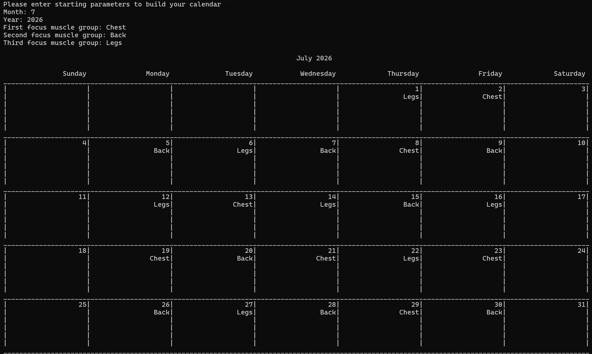

This project contains a program that prints a calendar with a plan for a month's workouts. Each week has a primary focus muscle group that is scheduled for Monday, Wednesday, and Friday. The next week's focus group is scheduled for Tuesday, and the previous week's focus group is scheduled for Thursday.

To run the program, execute the following steps:

1. Compile the code using `g++ Day.cpp Week.cpp Month.cpp Calendar.cpp main.cpp -o calendar`

2. Run the executable with `./calendar`

3. When prompted, enter the month number (e.g., enter 7 for July)

4. You will then be prompted to enter the first, second, and third focus muscle groups

Example run:
